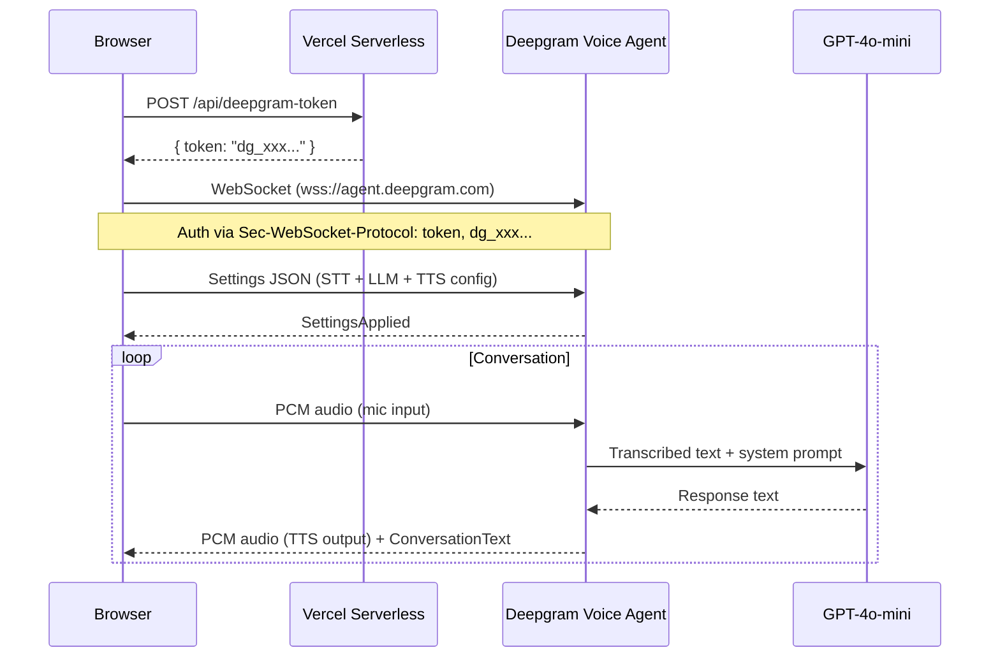

# Deepgram Voice Agent — Full Implementation Guide

> Complete walkthrough of implementing a live AI voice receptionist on an Astro/Vercel website using the Deepgram Voice Agent API. Built for Down To Earth AI and designed as a reusable blueprint for other websites.

---

## Architecture Overview



### Three Files, Three Responsibilities

| File | Purpose | Location |
|------|---------|----------|
| `api/deepgram-token.js` | Server-side token endpoint (Vercel serverless) | `/api/deepgram-token` |
| `public/assets/js/voice-agent.js` | Client-side voice agent (audio + WebSocket + prompt) | Static asset |
| `src/components/WidgetJaina.astro` | UI widget that loads and controls the agent | Astro component |

---

## Step 1: Deepgram Account Setup

1. Create account at [deepgram.com](https://deepgram.com)
2. Create a new API key with default permissions
3. Add `DEEPGRAM_API_KEY` to your Vercel environment variables
4. You get **$200 free credit** (~44 hours of talk time at $0.075/min on Standard tier)

> [!IMPORTANT]
> The API key is passed to the browser for WebSocket authentication. This is Deepgram's documented approach for client-side connections. Consider creating a **scoped, limited API key** specifically for this purpose rather than using your main key.

---

## Step 2: Server-Side Token Endpoint

### File: `api/deepgram-token.js`

This Vercel serverless function returns the Deepgram API key to the browser. It exists to:
- Keep the API key out of your client-side source code
- Apply CORS restrictions so only your domain can request it
- Provide a single place to swap keys or add rate limiting later

```javascript
export default async function handler(req, res) {
  // Only allow POST
  if (req.method !== 'POST') {
    res.setHeader('Allow', 'POST');
    return res.status(405).json({ error: 'Method not allowed' });
  }

  // CORS — restrict to your domain in production
  const allowedOrigins = [
    'https://yourdomain.co.uk',
    'https://www.yourdomain.co.uk',
    'http://localhost:4321',  // Astro dev server
    'http://localhost:3000',
  ];

  const origin = req.headers.origin;
  if (allowedOrigins.includes(origin)) {
    res.setHeader('Access-Control-Allow-Origin', origin);
  }
  res.setHeader('Access-Control-Allow-Methods', 'POST');
  res.setHeader('Access-Control-Allow-Headers', 'Content-Type');

  if (req.method === 'OPTIONS') {
    return res.status(200).end();
  }

  const apiKey = process.env.DEEPGRAM_API_KEY;
  if (!apiKey) {
    console.error('DEEPGRAM_API_KEY environment variable is not set');
    return res.status(500).json({ error: 'Voice service not configured' });
  }

  return res.status(200).json({ token: apiKey });
}
```

> [!WARNING]
> **Do NOT use JWT tokens.** We initially tried generating JWTs from the Deepgram SDK, but the Voice Agent WebSocket requires the raw API key passed via `Sec-WebSocket-Protocol`. JWTs do not work for this endpoint.

---

## Step 3: Client-Side Voice Agent

### File: `public/assets/js/voice-agent.js`

This is the core file. It handles everything: token fetching, microphone capture, WebSocket communication, audio playback, and state management.

### 3.1 Audio Constants

```javascript
const INPUT_SAMPLE_RATE = 16000;   // Mic → Deepgram (STT expects 16kHz)
const OUTPUT_SAMPLE_RATE = 24000;  // Deepgram → Speaker (TTS outputs 24kHz)
const CHUNK_DURATION_MS = 100;     // Send audio every 100ms
```

> [!IMPORTANT]
> These sample rates are **not configurable** — Deepgram's STT expects 16kHz input and TTS outputs 24kHz. Using wrong values causes distorted/silent audio.

### 3.2 WebSocket Authentication

```javascript
const url = 'wss://agent.deepgram.com/v1/agent/converse';
this._ws = new WebSocket(url, ['token', token]);
```

The API key is passed as the second element of the `Sec-WebSocket-Protocol` array. This is Deepgram's documented authentication method for browser-side WebSocket connections.

### 3.3 Settings Message

Once the WebSocket connects, send a `Settings` JSON message configuring the three pipeline stages:

```javascript
const settings = {
  type: 'Settings',
  audio: {
    input: {
      encoding: 'linear16',
      sample_rate: 16000,     // Must match INPUT_SAMPLE_RATE
    },
    output: {
      encoding: 'linear16',
      sample_rate: 24000,     // Must match OUTPUT_SAMPLE_RATE
      container: 'none',
    },
  },
  agent: {
    language: 'en',
    listen: {
      provider: {
        type: 'deepgram',
        model: 'nova-3',      // STT model (best accuracy)
      },
    },
    think: {
      provider: {
        type: 'open_ai',
        model: 'gpt-4o-mini', // LLM for generating responses
      },
      prompt: '...',          // System prompt (see Step 5)
    },
    speak: {
      provider: {
        type: 'deepgram',
        model: 'aura-2-pandora-en',  // TTS voice (see Step 6)
      },
    },
    greeting: '...',          // First thing the agent says (see Step 5)
  },
};
```

### 3.4 Microphone Capture

```javascript
// Get mic access
this._mediaStream = await navigator.mediaDevices.getUserMedia({
  audio: {
    sampleRate: INPUT_SAMPLE_RATE,
    channelCount: 1,
    echoCancellation: true,
    noiseSuppression: true,
    autoGainControl: true,
  },
});

// Create AudioContext at 16kHz
this._audioContext = new AudioContext({ sampleRate: INPUT_SAMPLE_RATE });
this._sourceNode = this._audioContext.createMediaStreamSource(this._mediaStream);

// Process in chunks and convert Float32 → Int16 PCM
this._processorNode.onaudioprocess = (e) => {
  const float32 = e.inputBuffer.getChannelData(0);
  const int16 = new Int16Array(float32.length);
  for (let i = 0; i < float32.length; i++) {
    const s = Math.max(-1, Math.min(1, float32[i]));
    int16[i] = s < 0 ? s * 0x8000 : s * 0x7FFF;
  }
  this._ws.send(int16.buffer);
};
```

> [!NOTE]
> We use `ScriptProcessorNode` instead of `AudioWorkletNode` for wider browser compatibility. Chrome shows a deprecation warning but it works fine. The `AudioWorkletNode` alternative requires a separate worker file and more complex setup.

### 3.5 Audio Playback (Gapless)

This was the trickiest part. Deepgram sends audio back as many small binary blobs. Playing them sequentially causes gaps and stuttering. The fix is **scheduled gapless playback**:

```javascript
_handleAudioBlob(blob) {
  blob.arrayBuffer().then((buffer) => {
    // Create dedicated playback AudioContext at 24kHz
    if (!this._playbackContext) {
      this._playbackContext = new AudioContext({ sampleRate: OUTPUT_SAMPLE_RATE });
      this._nextPlayTime = 0;
    }

    // Convert Int16 PCM → Float32
    const int16 = new Int16Array(buffer);
    const float32 = new Float32Array(int16.length);
    for (let i = 0; i < int16.length; i++) {
      float32[i] = int16[i] / 32768;
    }

    // Create AudioBuffer and source
    const audioBuffer = this._playbackContext.createBuffer(1, float32.length, OUTPUT_SAMPLE_RATE);
    audioBuffer.getChannelData(0).set(float32);

    const source = this._playbackContext.createBufferSource();
    source.buffer = audioBuffer;
    source.playbackRate.value = 1.1;  // Slightly faster/brighter (optional)
    source.connect(this._playbackContext.destination);

    // Schedule gapless: each chunk starts exactly when previous ends
    const now = this._playbackContext.currentTime;
    const startTime = Math.max(now, this._nextPlayTime);
    source.start(startTime);
    this._nextPlayTime = startTime + (audioBuffer.duration / 1.1);

    // Track for barge-in (stop when user starts talking)
    this._activeSources = this._activeSources || [];
    this._activeSources.push(source);
    source.onended = () => {
      const idx = this._activeSources.indexOf(source);
      if (idx > -1) this._activeSources.splice(idx, 1);
    };
  });
}
```

> [!IMPORTANT]
> **Two separate AudioContexts** are used — one for microphone input (16kHz) and one for playback output (24kHz). Using a single context causes sample rate conflicts.

### 3.6 Barge-In (User Interrupts Agent)

When the user starts speaking while the agent is talking, stop all queued audio immediately:

```javascript
case 'UserStartedSpeaking':
  this._stopPlayback();  // Kill all playing/queued audio
  this._setStatus('listening');
  break;

_stopPlayback() {
  if (this._activeSources) {
    this._activeSources.forEach(s => { try { s.stop(); } catch(e) {} });
    this._activeSources = [];
  }
  this._nextPlayTime = 0;
}
```

### 3.7 WebSocket Message Types

| Message Type | Direction | Meaning |
|---|---|---|
| `Welcome` | ← Server | Connection established |
| `SettingsApplied` | ← Server | Config accepted, ready to listen |
| `UserStartedSpeaking` | ← Server | User's voice detected |
| `ConversationText` | ← Server | Transcript (role: user or assistant) |
| `AgentThinking` | ← Server | LLM is generating response |
| `AgentStartedSpeaking` | ← Server | TTS audio is about to stream |
| `AgentAudioDone` | ← Server | All audio chunks sent |
| `History` | ← Server | Conversation history update |
| `Error` | ← Server | Something went wrong |

---

## Step 4: Widget Integration

### File: `src/components/WidgetJaina.astro`

The voice agent JS and CSS are loaded dynamically (not in the main bundle) to avoid bloating page load for users who never click the voice button:

```javascript
// ⚠️ CACHE-BUST REMINDER: If you edit voice-agent.js or voice-agent-ui.css,
// you MUST bump the ?v= version string below, otherwise Vercel CDN will serve stale cached files.
cssLink.href = '/assets/css/voice-agent-ui.css?v=20260510a';

const script = document.createElement('script');
// ⚠️ CACHE-BUST: Bump this version when voice-agent.js changes
script.src = '/assets/js/voice-agent.js?v=20260510a';
script.onload = () => initVoiceSession();
```

> [!CAUTION]
> **Always bump the `?v=` version string** when you edit `voice-agent.js`. Vercel's CDN caches static assets aggressively at edge nodes worldwide. Without cache-busting, different users (or even different browser profiles on the same machine) will get different cached versions of the file. This caused us to hear **three completely different voices** across three Chrome profiles until we added the version string.

---

## Step 5: System Prompt Engineering

### Greeting Strategy

**Use the same neutral greeting on every page.** Do NOT mention the trade or page in the greeting — it feels invasive, like a shop assistant saying "I see you're looking at the jeans."

```javascript
function buildGreeting(trade) {
  return "Hi there! Welcome to Down To Earth AI — what can I help you with?";
}
```

The AI knows which trade page the user is on via the system prompt context (passed silently), and will naturally tailor the conversation once the caller starts talking. But it never leads with it.

### Trade Context (Internal Only)

The trade is passed to the system prompt so the AI can relate answers to their specific trade, but the caller never hears "I see you're on the HVAC page":

```javascript
const tradeContext = trade
  ? `The caller is on the AI receptionist page for ${trade} businesses. They likely run a ${trade} business and are exploring whether an AI receptionist would work for them. Relate your answers to their trade — talk about the kinds of calls they get, missing enquiries while on site, and how an AI receptionist would handle things specific to their line of work.`
  : 'The caller is browsing the Down To Earth AI website.';
```

### Prompt Structure (current, recommended order)

The system prompt has **12 sections** in this specific order. The order matters — LLMs prioritise content at the top:

1. **Identity & context** — who you are, what you're doing right now, trade context
2. **Conversational flow rules** — THE most important section. "ONE SENTENCE AT A TIME" as rule 1. Includes BAD/GOOD examples.
3. **Demo context** — what the AI can/can't do in demo mode. How to handle "can you take my details?"
4. **Website awareness** — specific page names and how to direct people. NEVER say "visit our website."
5. **About Jeff & the company** — founder backstory, 25 years in trades, based in Bournemouth, GDPR compliant
6. **Trades served** — "we work with ANY trade" (not just the 13 listed)
7. **Services & pricing** — actual numbers. AI Receptionist £45/mo + £299 setup, channels £23/mo each, Lead Gen from £997, AI Marketing £99/mo, Consultations from £290
8. **How the AI receptionist actually works** — detailed explanation of phone calls, website chat, and add-on channels. The plumber-under-a-sink pitch.
9. **Setup process** — 6-step onboarding flow from booking to going live
10. **Key questions to answer directly** — 9 FAQ-style Q&As with exact answers the AI must give instead of deflecting
11. **Why tradesmen need this** — the core value proposition
12. **Call objectives & DO NOT rules** — what success looks like, explicit restrictions including anti-deflection rule

### Lessons Learned

The system prompt is the single most important factor in conversation quality. Here's what we learned through iteration:

#### ❌ Problem 1: Long monologues kill engagement
The AI gave multi-paragraph responses that made callers hang up.

**Fix:** Enforce a strict "ONE SENTENCE AT A TIME" rule at the top of the prompt, with explicit BAD/GOOD examples.

#### ❌ Problem 2: AI promises things it can't do
"Just a moment, I'll get you that link!" → then admits it can't.

**Fix:** Explicit rule: "NEVER promise to do something you can't do. You cannot send links, book appointments, take details, or perform any actions."

#### ❌ Problem 3: AI deflects instead of answering
"We have a pricing page" or "the HOW IT WORKS page has all the info" instead of actually answering the question.

**Fix:** Two-part fix:
1. Rule 6: "When asked about pricing, GIVE THE ACTUAL PRICE — don't say 'we have a pricing page'. Say 'It's £45 a month.'"
2. Comprehensive service knowledge embedded directly in the prompt (how it works, setup process, key FAQs) so the AI has enough information to answer without deflecting.
3. Explicit anti-deflection rule: "DEFLECT to a page when you know the answer. You have detailed knowledge above — USE IT. Only mention a page if they want MORE detail than you can give, or for taking action (booking, contacting)."

#### ❌ Problem 4: AI doesn't know where it is
Says "visit our website" when the caller is already ON the website.

**Fix:** "WEBSITE AWARENESS" section telling the AI exactly what pages exist and how to direct people: "Just click GET STARTED at the top of this page."

#### ❌ Problem 5: AI refuses to capture leads
"We don't take personal details directly" — defeats the purpose.

**Fix:** "DEMO CONTEXT" section explaining this is a demo, but the real version can be configured for lead capture, appointment booking, etc.

#### ❌ Problem 6: AI rejects unlisted trades
Only accepted the 13 pre-configured trades.

**Fix:** "We work with ANY trade" — be enthusiastic about everyone. Don't turn away business.

#### ❌ Problem 7: Greeting mentions the trade/page
"Hi! I see you're looking at our HVAC services" — implies we DO HVAC work and feels invasive.

**Fix:** Use the same neutral greeting everywhere: "Hi there! Welcome to Down To Earth AI — what can I help you with?" The trade context is used internally only.

#### ❌ Problem 8: AI lacks enough knowledge to answer properly
When asked "how does it work?" the AI said "the HOW IT WORKS page has all the info" because it didn't have enough detail in its prompt.

**Fix:** Added comprehensive sections covering: how the receptionist works on each channel, the setup process, key FAQ answers with exact responses, and the core value proposition. The AI now has everything it needs to answer common questions directly.

> [!TIP]
> Include **BAD/GOOD examples** in the prompt. LLMs learn from examples far more effectively than from abstract rules. Show it exactly what a bad response looks like and what you want instead.

---

## Step 6: Voice Selection

### Available British Voices (Aura-2)

| Model | Gender | Characteristics | Our Notes |
|---|---|---|---|
| `aura-2-pandora-en` | Feminine | Smooth, Calm, Melodic, Breathy | ✅ Currently using. Only British female. |
| `aura-2-draco-en` | Masculine | Warm, Approachable, Trustworthy, Baritone | Good but male — not right for receptionist persona |

### Older British Voices (Aura-1, lower quality)

| Model | Gender | Characteristics |
|---|---|---|
| `aura-athena-en` | Feminine, Mature | Calm, Smooth, Professional |
| `aura-helios-en` | Masculine | Professional, Clear, Confident |

### Playback Rate Tuning

Deepgram has no native pitch/speed controls. We adjust client-side using `AudioBufferSourceNode.playbackRate`:

```javascript
source.playbackRate.value = 1.1; // 10% faster, slightly higher pitch
```

| Value | Effect |
|---|---|
| `1.0` | Normal (default) |
| `1.05` | Subtly brighter |
| `1.1` | ✅ Currently using — noticeably more energetic without being unnatural |
| `1.15` | Starting to sound rushed |
| `0.9` | Slower, deeper — makes feminine voices sound older |

> [!WARNING]
> When using `playbackRate ≠ 1.0`, you must adjust the gapless scheduling duration: `this._nextPlayTime = startTime + (audioBuffer.duration / playbackRate)`. Otherwise you'll get gaps or overlaps between audio chunks.

---

## Step 7: Deepgram Pricing

| Component | Cost |
|---|---|
| STT (Nova-3) | Included in Voice Agent price |
| LLM (GPT-4o-mini) | Included in Voice Agent price |
| TTS (Aura-2) | Included in Voice Agent price |
| **Voice Agent total** | **$0.075/minute** (Standard tier) |

- $200 free credit on signup ≈ **2,667 minutes** ≈ **44 hours** of conversation
- Pay-as-you-go after that
- Growth tier: $0.06/min (commitment required)

---

## Troubleshooting Guide

### Problem: WebSocket connection fails immediately
**Cause:** Invalid API key or wrong WebSocket URL.
**Fix:** Check `DEEPGRAM_API_KEY` in Vercel env vars. URL must be `wss://agent.deepgram.com/v1/agent/converse`. Auth must use `['token', apiKey]` protocol array.

### Problem: Audio stutters / sounds like mic switching on and off rapidly
**Cause:** Playing audio chunks sequentially with gaps between them.
**Fix:** Use scheduled gapless playback with `AudioContext.currentTime` (see Step 3.5).

### Problem: Different users hear different voices
**Cause:** Vercel CDN caching old versions of `voice-agent.js` at different edge nodes.
**Fix:** Add `?v=YYYYMMDD` cache-bust parameter. Bump it every time you edit the file.

### Problem: Voice sounds like a slow old woman / deeper than expected
**Cause:** Either cached old code, or the voice model's natural delivery for certain text styles.
**Fix:** (1) Ensure cache-bust is working. (2) Try `playbackRate = 1.1` for brighter sound. (3) Avoid prompt instructions like "pause naturally" or "don't rush" which make the LLM generate slower-paced text.

### Problem: AI gives long monologues / doesn't let caller speak
**Cause:** System prompt doesn't enforce conversational rhythm strongly enough.
**Fix:** Put "ONE SENTENCE AT A TIME" as the very first rule. Include BAD/GOOD examples.

### Problem: AI says "visit our website" when caller is ON the website
**Cause:** No website awareness in the prompt.
**Fix:** Add a "WEBSITE AWARENESS" section listing specific page names and how to navigate to them.

### Problem: AI refuses to help with unlisted trades
**Cause:** Prompt says "serves 13 trades" and AI interprets this as a restriction.
**Fix:** Change to "we work with ANY trade" and list the 13 as pre-configured options.

### Problem: AI deflects to pages instead of answering questions
**Cause:** The AI doesn't have enough knowledge in the prompt to answer "how does it work?" or similar questions, so it redirects to the How It Works page.
**Fix:** Embed comprehensive service knowledge directly in the prompt: how the receptionist works on each channel, the setup process, key FAQ answers. Add explicit anti-deflection rule: "Only mention a page if they want MORE detail than you can give, or for taking action."

### Problem: Greeting says "I see you're looking at our HVAC services"
**Cause:** Trade-specific greeting implies the company provides that trade's services, and feels invasive.
**Fix:** Use the same neutral greeting on every page. Pass the trade context to the system prompt only — the AI uses it internally once the conversation starts.

### Problem: Voice breaks up on mobile / AI can't hear on mobile
**Cause:** Usually a stale browser cache or suspended AudioContext from a previous session.
**Fix:** Close the mobile browser fully and reopen. If persistent, the issue may be that mobile browsers don't honour custom `sampleRate` in the AudioContext constructor — they silently use the device's native rate (48kHz). A full fix would require client-side resampling.

### Problem: ScriptProcessorNode deprecation warning
**Cause:** Chrome warns about `ScriptProcessorNode` being deprecated in favour of `AudioWorkletNode`.
**Fix:** It still works fine. To upgrade to `AudioWorkletNode`, you'd need a separate worker file. Not urgent.

---

## File Checklist for New Projects

When implementing this on a new website, you need:

- [ ] **Deepgram API key** added to Vercel environment variables (`DEEPGRAM_API_KEY`)
- [ ] **`api/deepgram-token.js`** — token endpoint (update CORS origins for your domain)
- [ ] **`public/assets/js/voice-agent.js`** — voice agent (update system prompt for the new business)
- [ ] **`public/assets/css/voice-agent-ui.css`** — UI styles for the voice modal
- [ ] **UI component** — button to trigger, modal to display status, transcript area
- [ ] **Cache-bust version strings** — in the widget loader, with reminder comments to bump on every change
- [ ] **System prompt** customised for the specific business:
  - Services and pricing (actual numbers)
  - How the service works (detailed enough to answer questions)
  - Setup process
  - Key FAQ answers (exact responses for common questions)
  - Company/founder background
  - Website pages and navigation
  - Trade-specific context (if applicable)
  - DO NOT rules and anti-deflection rule

---

## Deepgram Voice Agent API Reference

- **WebSocket endpoint:** `wss://agent.deepgram.com/v1/agent/converse`
- **Auth:** `Sec-WebSocket-Protocol: token, YOUR_API_KEY`
- **Input audio:** Linear16 PCM, 16kHz, mono
- **Output audio:** Linear16 PCM, 24kHz, mono
- **STT model:** `nova-3` (best accuracy)
- **LLM:** `gpt-4o-mini` (fast, cheap) or `gpt-4o` (smarter, slower)
- **TTS models:** See [Deepgram TTS docs](https://developers.deepgram.com/docs/tts-models)
- **Docs:** [Deepgram Voice Agent API](https://developers.deepgram.com/docs/voice-agent)

---

## Changes Made (Full Changelog)

| Change | What Happened |
|---|---|
| Voice model swap | Thalia (US) → Pandora (British female) |
| Auth fix | JWT tokens → raw API key passthrough |
| Audio fix | Sequential playback → gapless scheduled playback |
| Prompt v1 | Basic receptionist with pricing facts |
| Prompt v2 | Added conversational flow rules (one sentence max) |
| Prompt v3 | Website awareness, Jeff backstory, accept all trades, demo context, direct answers |
| Cache-busting | Added `?v=` version strings + reminder comments |
| Playback rate | Added `1.1x` for brighter, more energetic voice |
| Greeting fix | Trade-specific greeting → same neutral greeting on all pages |
| Prompt v4 | Added comprehensive service knowledge: how it works, setup process, 9 key FAQ answers, value proposition, anti-deflection rule |
| Current version | `?v=20260510a` |
